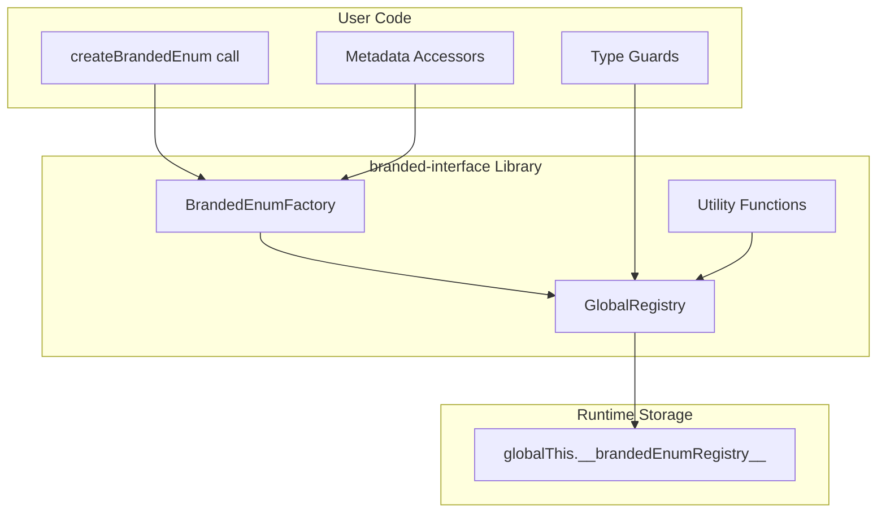

# Design Document: branded-interface

## Overview

The branded-interface library provides a mechanism for creating runtime-identifiable enum-like types in TypeScript. Unlike standard TypeScript enums which are erased at compile time, branded enums carry metadata that enables runtime identification of which enum a value belongs to.

The library uses a factory pattern to create enum objects with hidden metadata properties, a global registry for cross-bundle tracking, and type guards for safe type narrowing. Values remain raw strings for serialization compatibility while metadata is stored in non-enumerable properties.

## Architecture



### Key Design Decisions

1. **Non-enumerable metadata**: `__enumId` and `__values` are stored as non-enumerable properties using `Object.defineProperty`. This ensures they don't appear in `Object.keys()`, `Object.values()`, `for...in` loops, or JSON serialization.

2. **Global registry via globalThis**: Using `globalThis` ensures the registry is shared across different bundles, ESM/CJS modules, and even different instances of the library.

3. **Set-based value lookup**: Each enum stores its values in a `Set` for O(1) membership checks, matching the pattern already used in brightchain-lib's i18n implementation.

4. **Frozen objects**: Branded enums are frozen with `Object.freeze()` to prevent modification after creation, matching standard enum behavior.

5. **Symbol-based metadata keys**: Using Symbols instead of string keys for metadata prevents accidental access and collision with user-defined keys.

## Components and Interfaces

### Core Types

```typescript
/** Symbol keys for metadata (not exported, internal use only) */
declare const ENUM_ID: unique symbol;
declare const ENUM_VALUES: unique symbol;

/** Metadata attached to branded enums */
interface BrandedEnumMetadata {
  [ENUM_ID]: string;
  [ENUM_VALUES]: Set<string>;
}

/** A branded enum object - the values object plus metadata */
type BrandedEnum<T extends Record<string, string>> = Readonly<T> & BrandedEnumMetadata;

/** Extract the value type from a branded enum */
type BrandedEnumValue<E extends BrandedEnum<Record<string, string>>> = 
  E extends BrandedEnum<infer T> ? T[keyof T] : never;

/** Registry entry for tracking enums */
interface RegistryEntry {
  enumId: string;
  enumObj: BrandedEnum<Record<string, string>>;
  values: Set<string>;
}

/** Global registry structure */
interface BrandedEnumRegistry {
  enums: Map<string, RegistryEntry>;
  valueIndex: Map<string, Set<string>>; // value -> Set of enumIds
}
```

### Factory Function

```typescript
/**
 * Creates a branded enum with runtime metadata
 * @param enumId - Unique identifier for this enum
 * @param values - Object containing key-value pairs (use `as const` for literal types)
 * @returns A frozen branded enum object
 * @throws Error if enumId is already registered
 */
function createBrandedEnum<T extends Record<string, string>>(
  enumId: string,
  values: T
): BrandedEnum<T>;
```

### Type Guards

```typescript
/**
 * Checks if a value belongs to a specific branded enum
 * @param value - The value to check
 * @param enumObj - The branded enum to check against
 * @returns true if value is in the enum, with type narrowing
 */
function isFromEnum<E extends BrandedEnum<Record<string, string>>>(
  value: unknown,
  enumObj: E
): value is BrandedEnumValue<E>;

/**
 * Asserts that a value belongs to a branded enum, throwing if not
 * @param value - The value to check
 * @param enumObj - The branded enum to check against
 * @returns The value with narrowed type
 * @throws Error if value is not in the enum
 */
function assertFromEnum<E extends BrandedEnum<Record<string, string>>>(
  value: unknown,
  enumObj: E
): BrandedEnumValue<E>;
```

### Metadata Accessors

```typescript
/**
 * Gets the enum ID from a branded enum
 * @param enumObj - The branded enum
 * @returns The enum ID or undefined if not a branded enum
 */
function getEnumId(enumObj: unknown): string | undefined;

/**
 * Gets all values from a branded enum as an array
 * @param enumObj - The branded enum
 * @returns Array of values or undefined if not a branded enum
 */
function getEnumValues<E extends BrandedEnum<Record<string, string>>>(
  enumObj: E
): BrandedEnumValue<E>[] | undefined;

/**
 * Gets the number of values in a branded enum
 * @param enumObj - The branded enum
 * @returns The count or undefined if not a branded enum
 */
function enumSize(enumObj: unknown): number | undefined;
```

### Registry Functions

```typescript
/**
 * Finds all enum IDs that contain a given value
 * @param value - The value to search for
 * @returns Array of enum IDs containing the value
 */
function findEnumSources(value: string): string[];

/**
 * Gets all registered enum IDs
 * @returns Array of all enum IDs
 */
function getAllEnumIds(): string[];

/**
 * Gets a branded enum by its ID
 * @param enumId - The enum ID to look up
 * @returns The branded enum or undefined
 */
function getEnumById(enumId: string): BrandedEnum<Record<string, string>> | undefined;
```

### Utility Functions

```typescript
/**
 * Checks if a value exists in a branded enum (reverse lookup)
 * @param enumObj - The branded enum
 * @param value - The value to check
 * @returns true if the value exists
 */
function hasValue<E extends BrandedEnum<Record<string, string>>>(
  enumObj: E,
  value: unknown
): value is BrandedEnumValue<E>;

/**
 * Gets the key name for a value in a branded enum
 * @param enumObj - The branded enum
 * @param value - The value to look up
 * @returns The key name or undefined
 */
function getKeyForValue<E extends BrandedEnum<Record<string, string>>>(
  enumObj: E,
  value: string
): keyof E | undefined;

/**
 * Checks if a key exists in a branded enum
 * @param enumObj - The branded enum
 * @param key - The key to check
 * @returns true if the key exists
 */
function isValidKey<E extends BrandedEnum<Record<string, string>>>(
  enumObj: E,
  key: unknown
): key is keyof E;

/**
 * Returns an iterator of [key, value] pairs
 * @param enumObj - The branded enum
 * @returns Iterator of entries
 */
function enumEntries<E extends BrandedEnum<Record<string, string>>>(
  enumObj: E
): IterableIterator<[keyof E, BrandedEnumValue<E>]>;
```

### Composition Functions

```typescript
/**
 * Merges multiple branded enums into a new one
 * @param newId - ID for the merged enum
 * @param enums - Branded enums to merge
 * @returns A new branded enum containing all values
 * @throws Error if there are duplicate keys
 */
function mergeEnums<T extends BrandedEnum<Record<string, string>>[]>(
  newId: string,
  ...enums: T
): BrandedEnum<UnionToIntersection<T[number] extends BrandedEnum<infer U> ? U : never>>;
```

## Data Models

### Global Registry Structure

The registry is stored on `globalThis` to ensure cross-bundle compatibility:

```typescript
// Registry key (using a namespaced string to avoid collisions)
const REGISTRY_KEY = '__brandedEnumRegistry__' as const;

// Registry structure
interface GlobalRegistry {
  // Map from enumId to registry entry
  enums: Map<string, {
    enumId: string;
    enumObj: BrandedEnum<Record<string, string>>;
    values: Set<string>;
  }>;
  
  // Reverse index: value -> Set of enumIds containing that value
  valueIndex: Map<string, Set<string>>;
}

// Initialization (lazy, on first use)
function getRegistry(): GlobalRegistry {
  if (!(REGISTRY_KEY in globalThis)) {
    (globalThis as any)[REGISTRY_KEY] = {
      enums: new Map(),
      valueIndex: new Map(),
    };
  }
  return (globalThis as any)[REGISTRY_KEY];
}
```

### Branded Enum Object Structure

```typescript
// Example of what a branded enum looks like at runtime
const ExampleEnum = {
  // User-defined values (enumerable)
  Key1: 'value1',
  Key2: 'value2',
  
  // Metadata (non-enumerable, Symbol keys)
  [ENUM_ID]: 'example',           // Symbol property
  [ENUM_VALUES]: Set { 'value1', 'value2' }  // Symbol property
};

// Object.keys(ExampleEnum) => ['Key1', 'Key2']
// Object.values(ExampleEnum) => ['value1', 'value2']
// JSON.stringify(ExampleEnum) => '{"Key1":"value1","Key2":"value2"}'
```


## Correctness Properties

*A property is a characteristic or behavior that should hold true across all valid executions of a system—essentially, a formal statement about what the system should do. Properties serve as the bridge between human-readable specifications and machine-verifiable correctness guarantees.*

Based on the prework analysis, the following properties have been consolidated to eliminate redundancy:

### Property 1: Enum Creation Correctness

*For any* valid enum ID and values object, creating a branded enum SHALL:
- Return an object where all provided keys map to their corresponding values
- Attach metadata with the correct enum ID
- Attach metadata with a Set containing exactly the provided values
- Register the enum in the global registry
- Return raw string values when accessed (no wrappers)

**Validates: Requirements 1.1, 1.2, 1.3, 1.4, 1.6**

### Property 2: Type Guard Correctness

*For any* branded enum and any value:
- `isFromEnum(value, enum)` returns `true` if and only if the value exists in the enum's value set
- `isFromEnum` returns `false` for non-string values (null, undefined, numbers, objects)
- `isFromEnum` returns `false` when the second argument is not a branded enum

**Validates: Requirements 2.1, 2.2, 2.4, 2.5**

### Property 3: Find Enum Sources Correctness

*For any* string value:
- `findEnumSources(value)` returns an array containing exactly the IDs of all enums that contain that value
- If no enums contain the value, returns an empty array
- If multiple enums contain the same value, all their IDs are included

**Validates: Requirements 3.1, 3.2, 3.3**

### Property 4: Metadata Accessor Correctness

*For any* object:
- `getEnumId(obj)` returns the enum ID if obj is a branded enum, undefined otherwise
- `getEnumValues(obj)` returns an array of all values if obj is a branded enum, undefined otherwise
- The returned values array contains exactly the values used at creation

**Validates: Requirements 4.1, 4.2, 4.3, 4.4**

### Property 5: Duplicate ID Rejection

*For any* enum ID that has already been used to create a branded enum:
- Attempting to create another branded enum with the same ID SHALL throw an error

**Validates: Requirements 5.2**

### Property 6: Registry Lookup Correctness

*For any* set of created branded enums:
- `getAllEnumIds()` returns an array containing exactly the IDs of all created enums
- `getEnumById(id)` returns the branded enum object for valid IDs
- `getEnumById(id)` returns undefined for IDs that were never registered

**Validates: Requirements 5.3, 5.4, 5.5**

### Property 7: Serialization and Enumeration Correctness

*For any* branded enum:
- `JSON.stringify(enum)` produces a JSON object containing only the user-defined key-value pairs (no metadata)
- `JSON.parse(JSON.stringify(enum))` equals the original values object
- `Object.keys(enum)` returns exactly the user-defined keys
- `Object.values(enum)` returns exactly the user-defined values
- `Object.entries(enum)` returns exactly the user-defined key-value pairs
- Spreading `{...enum}` copies only the user-defined properties
- The `in` operator returns true for user keys, false for metadata symbols

**Validates: Requirements 6.1, 6.2, 6.3, 8.1, 8.2, 8.3, 8.4, 8.5**

### Property 8: Reverse Lookup Correctness

*For any* branded enum and any value:
- `hasValue(enum, value)` returns true if and only if the value exists in the enum
- `getKeyForValue(enum, value)` returns the key that maps to the value if it exists
- `getKeyForValue(enum, value)` returns undefined if the value doesn't exist
- For all values in an enum, `enum[getKeyForValue(enum, value)] === value`

**Validates: Requirements 9.1, 9.2, 9.3**

### Property 9: Enum Size Correctness

*For any* branded enum created with N key-value pairs:
- `enumSize(enum)` returns N
- `enumSize(enum)` equals `Object.keys(enum).length`

**Validates: Requirements 9.4**

### Property 10: Enum Entries Iterator Correctness

*For any* branded enum:
- `enumEntries(enum)` yields exactly the same pairs as `Object.entries(enum)`
- Collecting all entries produces an array equal to `Object.entries(enum)`

**Validates: Requirements 9.5**

### Property 11: Key Validation Correctness

*For any* branded enum and any key:
- `isValidKey(enum, key)` returns true if and only if the key exists in the enum
- `isValidKey(enum, key)` returns false for metadata symbol keys

**Validates: Requirements 9.6**

### Property 12: Assert Type Guard Correctness

*For any* branded enum and any value:
- `assertFromEnum(value, enum)` returns the value unchanged if it exists in the enum
- `assertFromEnum(value, enum)` throws an error if the value doesn't exist in the enum
- The thrown error message includes the value and enum ID for debugging

**Validates: Requirements 9.7, 9.8**

### Property 13: Enum Merge Correctness

*For any* set of branded enums being merged:
- The merged enum contains all key-value pairs from all source enums
- Duplicate values (same value in multiple enums) are preserved
- The merged enum is registered in the global registry as a new enum
- `findEnumSources` for values in the merged enum includes the merged enum's ID

**Validates: Requirements 10.1, 10.2, 10.4**

### Property 14: Merge Key Collision Rejection

*For any* set of branded enums where two or more have the same key:
- `mergeEnums` SHALL throw an error indicating the duplicate key

**Validates: Requirements 10.3**

## Error Handling

### Error Types

The library defines the following error conditions:

| Error Condition | Function | Error Message Pattern |
|----------------|----------|----------------------|
| Duplicate enum ID | `createBrandedEnum` | `Branded enum with ID "${enumId}" already exists` |
| Duplicate key in merge | `mergeEnums` | `Cannot merge enums: duplicate key "${key}" found` |
| Value not in enum | `assertFromEnum` | `Value "${value}" is not a member of enum "${enumId}"` |
| Invalid enum object | `assertFromEnum` | `Second argument is not a branded enum` |

### Error Handling Strategy

1. **Fail Fast**: Errors are thrown immediately when invalid conditions are detected
2. **Descriptive Messages**: All error messages include relevant context (enum ID, value, key)
3. **No Silent Failures**: Functions that can fail either throw or return undefined (never return incorrect data)
4. **Type Safety**: TypeScript types prevent many error conditions at compile time

### Graceful Degradation

Functions that query state return `undefined` for invalid inputs rather than throwing:
- `getEnumId(nonBrandedObject)` → `undefined`
- `getEnumValues(nonBrandedObject)` → `undefined`
- `getEnumById(unknownId)` → `undefined`
- `getKeyForValue(enum, unknownValue)` → `undefined`

## Testing Strategy

### Dual Testing Approach

The library uses both unit tests and property-based tests for comprehensive coverage:

**Unit Tests** focus on:
- Specific examples demonstrating correct behavior
- Edge cases (empty enums, single-value enums, special characters)
- Error conditions and error message content
- Integration with globalThis across module boundaries

**Property-Based Tests** focus on:
- Universal properties that hold for all valid inputs
- Comprehensive input coverage through randomization
- Invariants that must always be maintained

### Property-Based Testing Configuration

- **Library**: fast-check (already in devDependencies)
- **Minimum iterations**: 100 per property test
- **Tag format**: `Feature: branded-interface, Property {number}: {property_text}`

### Test File Structure

```
branded-interface/
├── src/
│   ├── index.ts              # Main exports
│   ├── factory.ts            # createBrandedEnum implementation
│   ├── registry.ts           # Global registry management
│   ├── guards.ts             # Type guards (isFromEnum, assertFromEnum)
│   ├── accessors.ts          # Metadata accessors
│   ├── utils.ts              # Utility functions
│   └── types.ts              # TypeScript type definitions
└── src/__tests__/
    ├── factory.spec.ts       # Unit tests for factory
    ├── factory.property.spec.ts  # Property tests for factory
    ├── guards.spec.ts        # Unit tests for type guards
    ├── guards.property.spec.ts   # Property tests for type guards
    ├── registry.spec.ts      # Unit tests for registry
    ├── registry.property.spec.ts # Property tests for registry
    ├── utils.spec.ts         # Unit tests for utilities
    ├── utils.property.spec.ts    # Property tests for utilities
    └── merge.property.spec.ts    # Property tests for merge functionality
```

### Generator Strategy for Property Tests

```typescript
// Arbitrary for valid enum ID (non-empty string, no special chars)
const enumIdArb = fc.string({ minLength: 1, maxLength: 50 })
  .filter(s => /^[a-zA-Z][a-zA-Z0-9_-]*$/.test(s));

// Arbitrary for enum key (valid JS identifier)
const enumKeyArb = fc.string({ minLength: 1, maxLength: 30 })
  .filter(s => /^[a-zA-Z_][a-zA-Z0-9_]*$/.test(s));

// Arbitrary for enum value (any non-empty string)
const enumValueArb = fc.string({ minLength: 1, maxLength: 100 });

// Arbitrary for a values object
const valuesObjectArb = fc.dictionary(enumKeyArb, enumValueArb, { minKeys: 1, maxKeys: 20 });

// Arbitrary for a complete branded enum (creates unique ID per test)
const brandedEnumArb = fc.tuple(enumIdArb, valuesObjectArb)
  .map(([id, values]) => {
    const uniqueId = `${id}_${Date.now()}_${Math.random()}`;
    return createBrandedEnum(uniqueId, values);
  });
```

### Coverage Goals

- **Line coverage**: > 95%
- **Branch coverage**: > 90%
- **Property coverage**: All 14 correctness properties implemented as property tests
